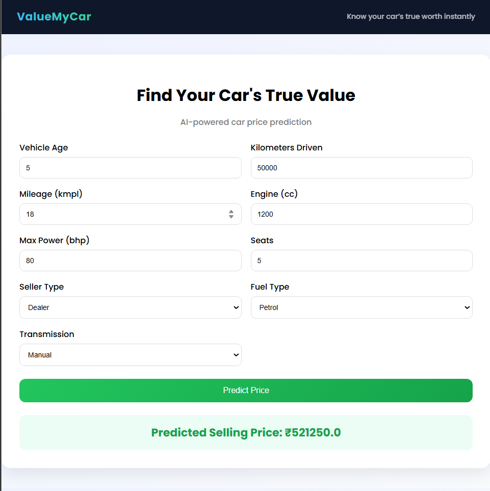
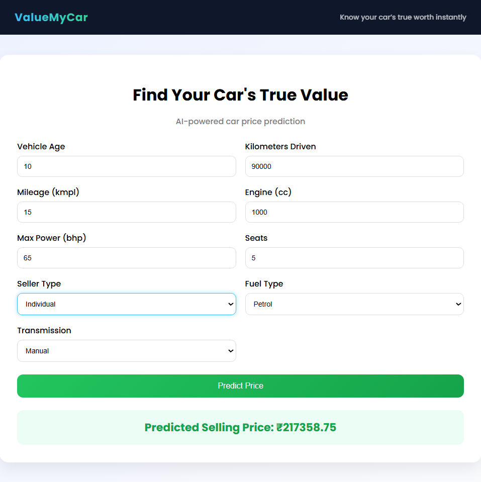
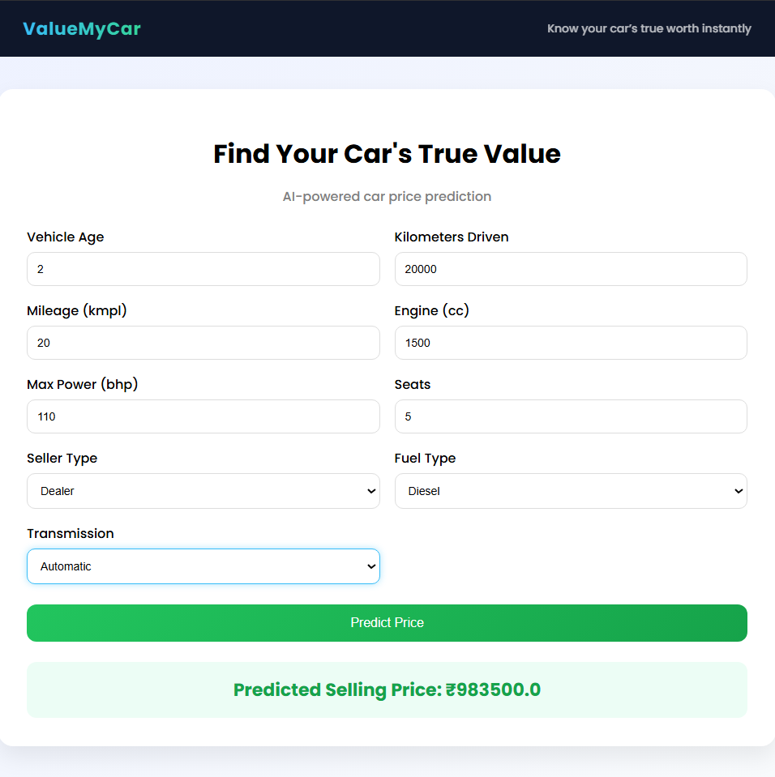

#  ValueMyCar - Car Price Prediction

## 📌 Project Overview

ValueMyCar is a Machine Learning web application that predicts the selling price of a used car based on user inputs.
It uses a trained ML model integrated with a Flask backend and a modern user interface.

---

## 🚀 Features

* AI-powered car price prediction
* Clean and responsive user interface
* Real-time prediction using Flask
* Easy-to-use input form

---

## 🧠 Technologies Used

* Python
* Flask
* Scikit-learn
* NumPy
* HTML, CSS

---

## 📊 Input Parameters

* Vehicle Age
* Kilometers Driven
* Mileage
* Engine
* Max Power
* Seats
* Seller Type
* Fuel Type
* Transmission

---

## 📦 Model File

The trained model file is large and not included in this repository.

🔗 Download the model from Google Drive:
https://drive.google.com/file/d/1-Lv5PicmM5xFuYwjQpLNzb_A5KHTfVPT/view?usp=sharing

After downloading, place the file in the project root folder:

best_model.pkl

---

## ▶️ How to Run

```bash
pip install -r requirements.txt
python app.py
```

Then open in browser:
http://127.0.0.1:8001/

---

## 📷 Screenshots

### 🏠 Example 1 - Standard Car Prediction



### 🚙 Example 2 - Older Car Prediction



### 🚘 Example 3 - Premium Car Prediction



---

## 📷 Output

Displays predicted selling price based on the given inputs.

---

## 💡 Future Improvements

* Add car brand and model features
* Improve accuracy using advanced models (XGBoost)
* Deploy the application online

---

## 👨‍💻 Author

James Alwin
